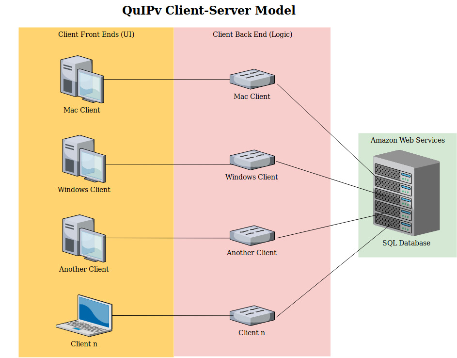

## OO Design & UML

> 3 PAGES

> 

---

- High-level architecture diagram: Client server application for macOS & Windows (depends on AWS database)
- Explain each component of diagram
- Static back-end UML & Dynamic UML: Describe context/ use case, motivation for choice of aspect (challenges), knowledge gained from modeling choices 

---

#### Client Server Diagram

