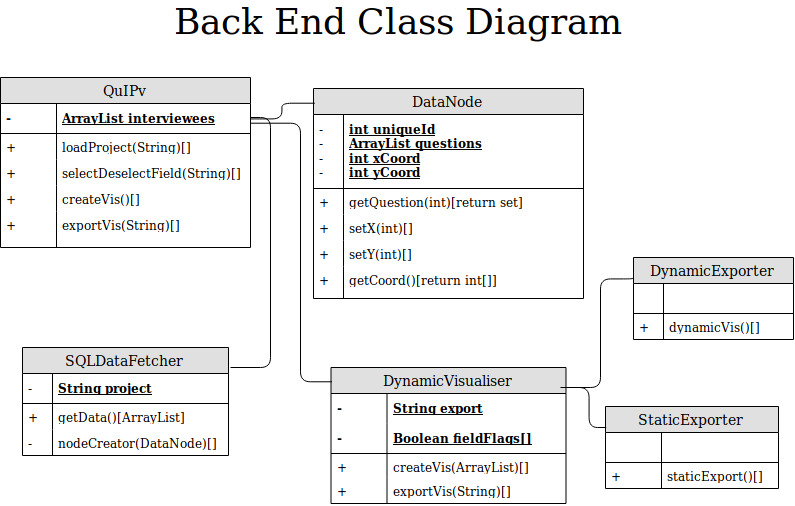
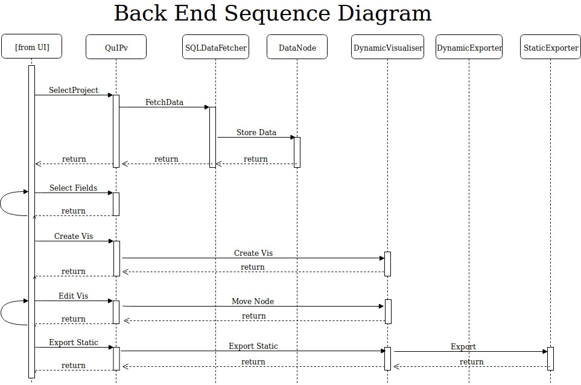

 OO Design & UML
===

|Component|Use|
|:---:|:---:|
|Client Front End|The UI for the application. Users choose which data to retrieve, can manipulate the visualisations & export the causal chain (dynamically or statically)|
|Client Back End|This is the logic of the application. Taking instructions from the UI, the back end retrieves data from AWS, can create causal chain visualisations & export them|
|AWS Server|External servers hosted by Amazon, which currently store the database of all research carried out by Bath SDR. Data will be retrieved by SQL to be loaded into the causal chain visualisation|

> Back End Structure

> The main goal of the project is to decrease the time and effort needed to create visualisations for
causal chain analysis

This diagram was created in relation to the main goal of the project outlined above.
Picking this apart further we see key requirements for this goal such as reduced effort
which can be accomplished through limited functionality a bespoke solution can afford i.e.
the system only does what it will be used for.

The back end of the system needs to be clearly set out, in order to allow for expansion of functionality
or increased data set size & scalability in the future. This is why the `DataNode` structure is used,
which can easily link drivers to outcomes implemented as an `ArrayList` in `QuIPv`.

Splitting the exports into seperate classes while providing a base visualiser class means
new export types can easily be added in the future as well as new types of visualisation. The
development of these two functionalities may allow Bath SDR to not require the use of MicroStrategy
making analysis quicker and less complex (meeting our main goal).

> Standard flow Use Case

This diagram is based on a standard use case for our application. We start by choosing a study to
load in, before fetching it from AWS & storing it in `DataNodes`. The required fields are selected
by the user, before they create the visualisation. After the visualisation is made it can be edited,
before being exported (statically in this case).

This model better illustrates the interactions between components in our system by clearly showing when
& where they interact. Combined with other sequence diagrams, this can form a basis for our test cases
by looking at what will happen with unexpected flow e.g. creating a visualisation without any data or fields
selected.

Combined with the class diagrams we can change which types of data are stored where, leading to less passing 
of variables and neater code. We thought that using a central module to control interactions with the UI we 
can better control the flow of program, making it easier to find errors (than the UI calling any module it
needs directly).