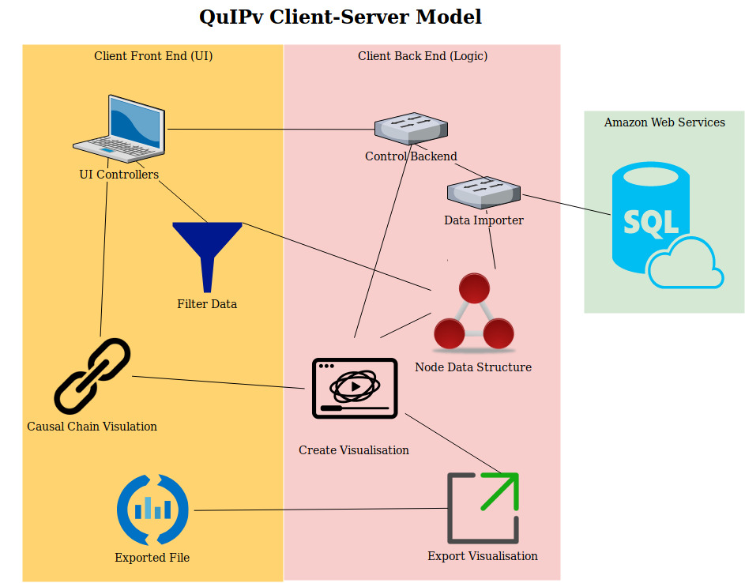

 OO Design & UML
===

|Component|Use|
|:---:|:---:|
|UI Controller|Controls all events _(button clicks/ hovers)_ for UI that are not linked to filtering data, or manipulating the causal chain diagram. Interacts with `Control Backend` in response to event|
|Filter Data|Tells the back end which field has been selected to filter in/out of visualisation|
|Causal Chain Visualisation|Displays the visualisation of the causal chain diagram. When a node is moved, its new position is relayed back to the `Node Data Structure`|
|Exported File|File containing exported visualisation, alongside a text file with the MD5 checksum|
|Control Backend|Interacts with `UI Controller` then calls relevant modules within the back end to carry out selected tasks|
|Data Importer|Imports data from `AWS` then passes it onto `Node Data Structure` to be stored|
|Node Data Structure|Stores the project data in a directed, unweight graph. Attributes can be manipulated by many of the modules|
|Create Visualisation|Using the `Node Data Structure` and filters, create a causal chain diagram, displayed in the front end by `Causal Chain Visualisation`|
|Export Visualisation|Using the diagram from `Create Visualisation` export the visualisation as either a static or dynamic file. This can be viewed as described in `Exported File`|
|AWS Server|External servers hosted by Amazon, which currently store the database of all research carried out by Bath SDR. Data will be retrieved by SQL to be loaded into `Data Importer`|
|Node.js|This is a very powerful visual library which we can utilise during `Create Visualisation`|
|Other java libraries|There are many other java libraries we will rely upon, including things such as `ArrayList` and `SQL` |
|Maven|Maven will be utilised for all our testing, so is the integral compenent of test driven development for our system|
---

> Back End Structure

|Component|Use|
|:---:|:---:|
|QuIPv|This is the main backend controller of the program. It will interact with the UI Controller in order to determine which logic functionality to call|
|DataNode|This is the data structure to hold each elements of data from the SQL database. `setX`, `setY` are used to allow the user to update the diagram layout|
|SQLDataFetcher|This function fetches the data to be put into `DataNode` from the MySql database|
|DynamicVisualiser|Creates the visualisation from information in `DataNode`, according to the `fieldFlags`. Exportation of diagrams is also done through this module to ensure the diagram is created before it can be exported |
|StaticExporter|Creates a static file and MD5 checksum from the `DataNode` graph|
|DynamicExporter|Creates a dynamic file and MD5 checksum from the `DataNode` graph|

> The main goal of the project is to decrease the time and effort needed to create visualisations for
causal chain analysis

This diagram was created in relation to the main goal of the project outlined above.
By creating a bespoke solution for BSDR we can ensure all functionality will be used, meaning our program will be lightweight
 with a simple, intuative UI.

The back end of the system needs to be clearly set out, in order to allow for expansion of functionality
or increased data set size & scalability in the future. This is why the `DataNode` structure is used,
which can easily link drivers to outcomes implemented as an `ArrayList` in `QuIPv`.

The exporters are provided to allow BSDR to share the diagram with clients, as well as using them in their own reports. Splitting the exports into seperate classes while providing a base visualiser class means
new export types can easily be added in the future as well as new types of visualisation. The
development of these two functionalities may allow Bath SDR to not require the use of MicroStrategy
making analysis quicker and less complex (meeting our main goal).

---

> Standard flow Use Case

This diagram is based on a standard use case for our application. We start by choosing a study to
load in, before fetching it from AWS & storing it in `DataNodes`. The required fields are selected
by the user, before they create the visualisation. After the visualisation is made it can be edited,
before being exported (statically in this case).

This model better illustrates the interactions between components in our system by clearly showing when
& where they interact. Combined with other sequence diagrams, this can form a basis for our test cases
by looking at what will happen with unexpected flow e.g. creating a visualisation without any data or fields
selected.

Combined with the class diagrams we can change which data elements are stored where, leading to less passing 
of variables and neater code. We thought that by using a central module to control most interactions with the UI we 
can better control the flow of program, making it easier to find errors (than the UI calling any module it
needs directly).
