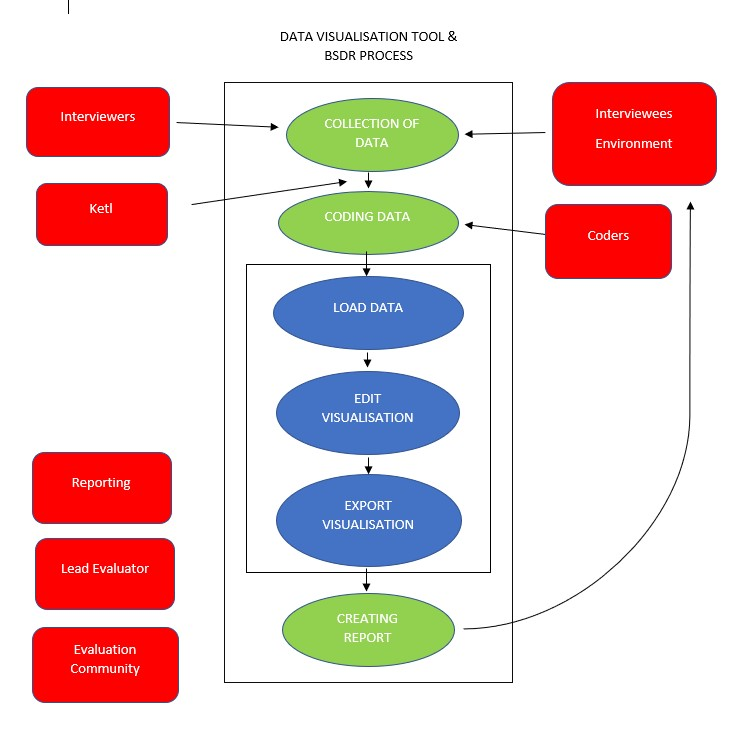

System Stakeholders
===

### About the Stakeholders
- Clients - Commission the collection of qualitative data bespoke to their own requirements, other clients may just use pre-existing collected data. Examples of clients are;
    - Donors (individuals/groups)
    - Other charities in area/sector
- Environment - This would be the area in which the surveys are conducted in. They play a major role in the outcome of the resulting data, but also can then be in turn affected by the collected data. For instance if the environment was to be chosen for future improvement projects.
- Interviewers - These are local researchers who conduct the collection of qualitative data from interviewees in the selected environment. They are told nothing about the organisation and project whose impact is being assessed, to reduces potenital bias from interviewees.
- Interviewees - Selected at random from the chosen environment, the interviewees provide the qualitative date. They answer a series of open-ended questions about changes in selected aspects of their lives and livelihoods over a specified period. Just like the environment, they affect the outcome of the collected data, but can also be affected by the date.
- Ketl - Is a company focused on data management and helps our client migrate his data to the software MicroStrategy.
- Coders - Take the raw field data and having been briefed about details of the project identifies and codes cause-and-effect statements in the data using the QuiP coding system.
- Reporting - Utilised the visualisations in a report, as requested by the client. It also includes analysed data displaying in a variety of ways to demonstrate the key positive and negative drivers of change, and potential links between project activities and incidental/external drivers of change.
- Lead Evaluator (co-ordinates study) - Organise the collection of data, the coding and reporting stages.
- Evaluation Community - QuiP is a new approach to the collection of qualitative date, the evaluation community ensure that it continues to tackles bias in data collection, and encourages real engagement with findings through the use of innovative interactive data visualisations.

-----

### Main Goal

The main goal of the project is to decrease the time and effort needed to create visualisations for causal chain analysis. In order to achieve this, we need to provide a cross platform application (Windows and macOS) described as follows:
### Functional requirements
- data is loaded from a mySQL database
- data is represented internally as a graph structure that connects drivers to outcomes using weighted edges
- the data is presented to the user as an interactive directed graph
- information about the drivers, outcomes and edges is displayed when the user hovers over them
- the vertices in the graph can be dragged. The metadata about the position of the vertices is maintained  
- the user can apply filters on the graph (eg. filtering out edges with weights under a certain value)
- the user can customise the values used as weights on the edges
- the graph can be saved as an image or interactive webpage

### Non-functional requirements

- the application has an easy to use interface
- a vertex can be both a driver and an outcome, i.e. an outcome can have a driver, but can in turn be a driver for another outcome
- the graph can be cyclic
- the graph will be displayed in an intuitive way, grouping drivers and outcomes into stories

#### References

[BathSDR](http://bathsdr.org/)
Accessed on : 09/11/18
