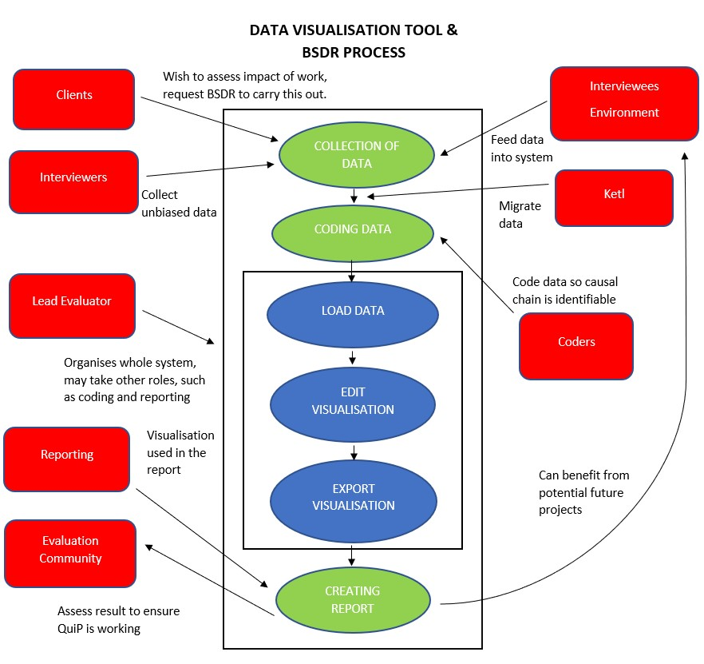

System Stakeholders
===

### About the Stakeholders
- Clients - Commission the collection of qualitative data bespoke to their own requirements, other clients may just use pre-existing collected data. Examples of clients are;
    - Donors (individuals/groups)
    - Other charities in area/sector
- Environment - This would be the area in which the surveys are conducted in. They play a major role in the outcome of the resulting data, but also can then be in turn affected by the collected data. For instance if the environment was to be chosen for future improvement projects.
- Interviewers - These are local researchers who conduct the collection of qualitative data from interviewees in the selected environment. They are told nothing about the organisation and project whose impact is being assessed, to reduces potential bias from interviewees.
- Interviewees - Selected at random from the chosen environment, the interviewees provide the qualitative date. They answer a series of open-ended questions about changes in selected aspects of their lives and livelihoods over a specified period. Just like the environment, they affect the outcome of the collected data, but can also be affected by the date.
- Ketl - Is a company focused on data management and helps our client migrate his data to the software MicroStrategy.
- Coders - Take the raw field data and having been briefed about details of the project identifies and codes cause-and-effect statements in the data using the QuiP coding system.
- Reporting - Utilised the visualisations in a report, as requested by the client. It also includes analysed data displaying in a variety of ways to demonstrate the key positive and negative drivers of change, and potential links between project activities and incidental/external drivers of change.
- Lead Evaluator (co-ordinates study) - Organise the collection of data, the coding and reporting stages.
- Evaluation Community - QuiP is a new approach to the collection of qualitative date, the evaluation community ensure that it continues to tackles bias in data collection, and encourages real engagement with findings through the use of innovative interactive data visualisations.

###Achieving Use-Case Goals
- Reporting - Have a range of useful visualisations to utilise in report for client
    1. Ensure sufficient qualitative data is collected, it is coded correctly and ready to be imported into visualisation software.
    1. Visualisation software correctly uses the coded data to represents the collected data. It must also have a few variations of ways to display chosen data. 
    1. Visualisation software exports the visualisation ready for use in the report, there may be multiple export types, static and dynamic.
    1. An unintended path through system, would be having limited variations of ways to display the data, and only being able to export the visualisation as a static image.
- Evaluation Community - To be able to assess process of investigation and the final findings to ensure QuiP is working
    1. Firstly the evaluation community would need to assess the collection of data, and how process of preparing it for use in the visualisation software. The QuiP is a part of this 
    stage and would be under the most scrutiny, to ensure it is working as it should be, to improve the use a qualitative data.
    1. The evaluation community may be interested in how the visualisation software takes the coded data, and uses it to represent the drivers of change, that is representative of the data originally collected.
    1. Reporting stage must be successfully completed, to assess the final findings, report, of the investigation.
- Client - To be able to assess impact of charitable work done, request BSDR to carry out report.
    1. Firstly they'll need to have conducted some sort of work that needs to have its impact assessed.
    1. The client then must contact BSDR to create with a bespoke solution to assessing the impact of their work.
    1. The client will then wait for the report which will detail drivers of change, the client can then themselves determine the impact of their work done.
    1. Alternative path would be being a client that doesn't need to assess impact of specific work, but would make use of already documented drivers of change. 

-----

### Main Goal

The main goal of the project is to decrease the time and effort needed to create visualisations for causal chain analysis. In order to achieve this, we need to provide a cross platform application (Windows and macOS) described as follows:

### Functional requirements
1. Loading and storing data:
    1. data is loaded from a mySQL database
    1. data is represented internally as a graph structure that connects drivers to outcomes using weighted edges
1. Manipulating the data:
    1. edges can be filtered out of the visualisations by their weight values
    1. nodes can be filtered out of the visualisations using column headings from the database
    1. nodes can be filtered out of the visualisations using specific queries/ key words in data entries
1. Creating visualisations:
    1. data is presented to the user as a directed, weighted graph
    1. the user can move nodes on the graph around to rearrange the visualisation
    1. information about nodes (drivers, outcomes) is displayed when the user hovers over them
    1. information about edges is displayed when the user hovers over them
    1. a vertex can be displayed as both a driver and an outcome
1. Exporting the visualisations:
    1. the graph can be  exported as a static image file e.g. .png
    1. the graph can be exported as an interactive file e.g. .html/.js

### Non-functional requirements
1. User Interface
    1. Use of all features of the program can be learnt within 1 hour from a guide
    1. The general flow of drivers to outcomes in the visualisation will be left to right
1. Maintainability & Extendability
    1. The underlying structure of the data will allow it to be used in different ways by allowing different types of connections between nodes in graphs
    1. The data strucutre for each node will allow any number of nodes to be implemented in a graph
1. Security
    1. Standard security protocols will be used to retrieve data from MySql database
    1. Exportation of the visualisations will be accompanied with a checksum(MD5) for safe file sharing
    1. No local data relating to QuIP research will be stored after the application is exited
1. Performance
    1. Data will be loaded from MySQL within 10 seconds on a 25Mbps network for a project with 24 interviewees (standard for QuIP methodology)
    1. Visualisations will be created within 15 seconds for the 24 interviewees
    1. All visualisations will be exported within 15 seconds

#### References

[_Bath Social & Development Research Ltd._](http://bathsdr.org/) 09/11/18
